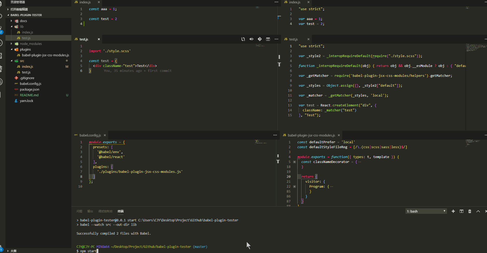

# 简陋的、自研 Babel 插件用的、一个环境~

## 启动

1. 克隆或下载项目到本地

2. 安装好依赖

3. 执行以下命令
    ```bash
    npm start
    ```

## 说明

启动构建后，在 `src/*.js` 中编写源码，保存后将在 `lib` 中生成同名的编译后代码，以验证 babel 插件的工作效果

## 示例

图片展示有点小，Chrome 上可以 `右键 - 在新标签页中打开图片` 查看大图



### 参考资料或辅助工具

- [手把手教你开发一个 babel-plugin](https://segmentfault.com/a/1190000016459270)
- [Babel 插件手册](https://github.com/jamiebuilds/babel-handbook/blob/master/translations/zh-Hans/plugin-handbook.md)
- [@babel/types](https://babeljs.io/docs/en/babel-types)
- [AST Explorer](https://astexplorer.net/)

